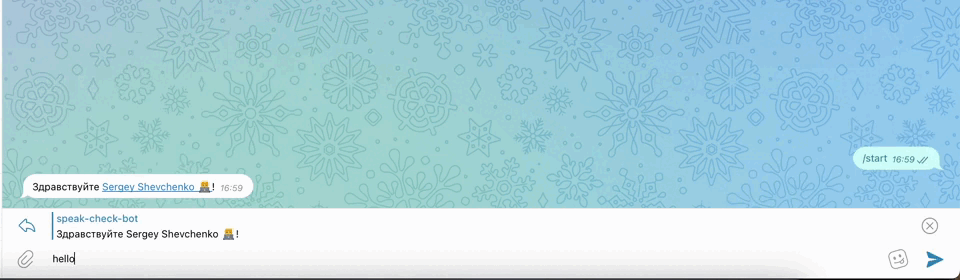
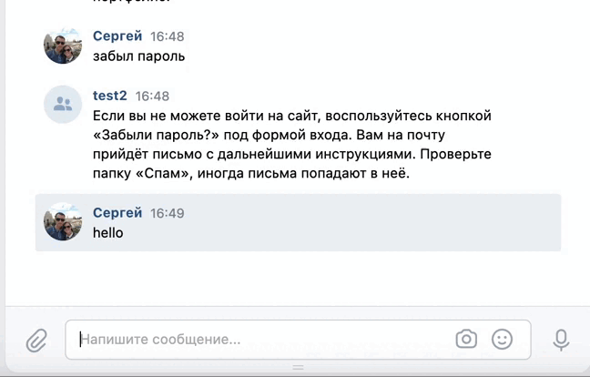

# Телеграм бот - speak-check-bot.

## Описание функционала
Скрипт состоит из нескольких частей: бот для общения в Telegram, бот для общения в группе во Вконтакте.\
Боты используют сервис Dialogflow от Google, который отвечает на запросы с использованием обучаемой нейросети.



## Настройка и запуск
Для успешного запуска необходимо указать переменные окружения в файле `.env` в корне проекта.\
Вам понадобится указать следующие переменные:\
**TG_BOT_TOKEN** - токен бота, который вы получили от **GodfatherBot**.\
**PROJECT_ID** - id проекта в Google Cloud.\
**TG_CHAT_ID** - id пользователя, которому слать сообщения.\
**GOOGLE_APPLICATION_CREDENTIALS** - путь до файла в формате json с ключами доступа к проекту в сервисе Google Cloud.\
**VK_GROUP_TOKEN** - токен группы в VK.\
Более подробно о том, как настраиваются и извлекаются переменные окружения, можно прочитать [здесь](https://pypi.org/project/environs/) или [здесь](https://docs.djangoproject.com/en/4.1/ref/settings/).

## Как запустить проект локально?
#### Склонируйте проект
```
https://github.com/sergiishevchenko/speak-check-bot
```
Далее введите следующие команды:
```
git clone <SSH address of this repo>
cd speak_check_bot/
python3 -m myenv venv
source venv\bin\activate
pip install -r requirements.txt
python3 tg_bot.py | python3 vk_bot.py
```
Поздравляю! Вы запустили бота!

## Цель проекта

Код написан в учебных целях, это часть курса по созданию [чат-ботов](https://dvmn.org/modules/chat-bots/)
на сайте веб-разработчиков [Девман](https://dvmn.org/api/docs/).
